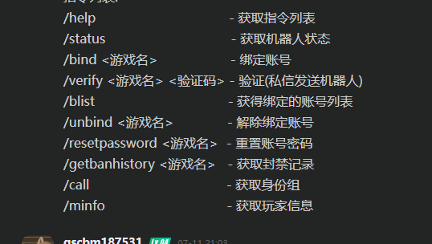
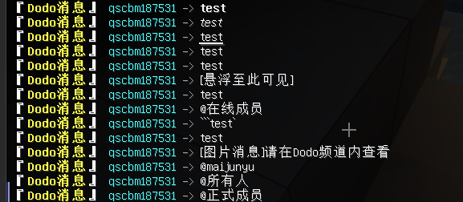
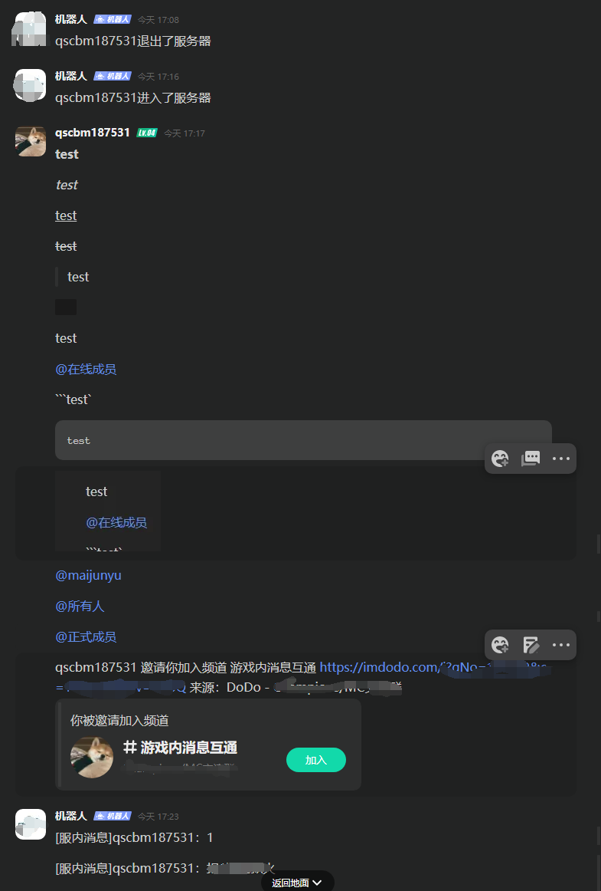

## DodoChat-Velocity
### 简介
DodoChat是一款Minecraft与Dodo频道消息互通的插件
### 注意
本插件有些功能其他服务器无法正常使用，请修改源代码后使用

建议使用前先把配置文件复制出来修改,没做什么报错处理
### 要求
服务端:Velocity或Spigot


插件:
- 代理端:
  - LibertyBans
  - LuckPerms
- spigot:
  - LuckPerms
### 配置文件
```yaml
# 设置项
settings:
  # Dodo消息转发相关
  SendDodoMessage:
    # 是否启用
    Enable: true
    # spigot子服使用的消息格式
    spigot-format: "§f§l『§e§lDodo消息§f§l』§r §b%sender% §7-> §f%message%"
    # 消息格式（%message%代表消息内容，%sender%代表发送者的群昵称，使用MiniMessage）
    # https://adventure-docs.minecraft.kim/minimessage.html
    format: "<bold>『<yellow>Dodo消息</yellow>』</bold> <aqua>%sender%</aqua> <gray>-></gray> %message%"
  # 服内消息转发相关
  # 注意支持markdown语法
  # https://open.imdodo.com/dev/api/message.html
  SendServerMessage:
    # 是否启用
    Enable: true
    # 消息格式（%message%代表消息内容，%sender%代表发送者的显示名）
    format: "[服内消息]%sender%：%message%"
  # 进服消息提醒（发送到Dodo频道）(连接到群组的初始服务器，一般只有一个服)
  JoinMessage:
    # 是否启用
    Enable: true
    # 消息格式（%player%代表玩家的显示名）
    format: "%player%进入了服务器"
  # 退服消息提醒（发送到Dodo频道）(同上)
  LeaveMessage:
    # 是否启用
    Enable: true
    # 消息格式（%player%代表玩家的显示名）
    format: "%player%退出了服务器"
  # 服务器列表，对应的服务求发送到哪个频道，spigot请使用spigot-server，并且只填写一个!
  Servers:
    # example:
    # spigot-server: "1112"
    server1: "1111"
  # 机器人机器人鉴权Token
  botToken: "token"
  # 机器人唯一标识
  botClientId: "clientId"
  #群号
  islandId: "1111"
  # Dodo发送命令频道
  # 不想要也很简单，随便填个频道号对不上就好
  # 这边建议和消息转发不同的频道
  # 命令最好还是用在代理端上，除非只有spigot
  dodoCommandChannelId: "11"
  # 数据库设置
  MySQL:
    # 地址(不用指定数据库，数据库:dodochat)
    url: jdbc:mysql://localhost:3306
    #账户
    name: root
    # 密码
    password: 123456
  # 分配权限组的设置(如果权限组不在这里不分配)
  Call:
    # 权限组
    - Group: "Admin"
      # 身份组id
      roleId: "111"
      # 权限组
    - Group: "Builder"
      # 身份组id
      roleId: "111"
      # 权限组
    - Group: "Default"
      # 身份组id
      roleId: "111"
```
### 图片


